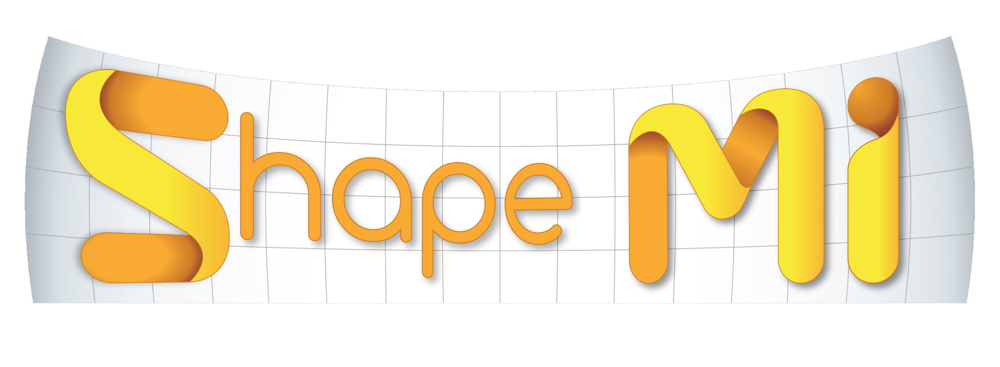

 We gladly announce the workshop on Shape in Medical Imaging (ShapeMI), which is held in conjunction with the conference on Medical Image Computing and Computer Assisted Interventions (<a href="http://www.miccai2018.org/en/" target="_blank">MICCAI 2018</a>) in Granada, Spain on September 20, 2018 (full day). This workshop arises from the previous MICCAI <a href="https://sites.google.com/site/sesami2016/" target="_blank">SeSAMI'16</a> and <a href="https://sites.google.com/site/miccaisami2015/" target="_blank">SAMI'15</a> Workshops as well as the <a href="http://www.shapesymposium.org" target="_blank">Shape Symposium</a> 2015 and 2014. It will provide a venue for researchers working in shape/geometric modeling, learning, analysis, statistics, classification and applications to share novel ideas, to present recent research results and to interact with each other.

Today’s image data usually represents 3D geometric structures, often describing continuous and time-varying phenomena. Therefore, shape and geometry processing methods have been receiving increased attention, for example, due to their higher sensitivity to local variations relative to traditional markers, such as the volume of a structure. Shape and spectral analysis, learning and modeling algorithms, as well as application-driven research are at the focus of this workshop. Shape analysis methods are broadly applicable to many different fields from medical image computing to paleontology, anthropology and beyond. 

# Topics

 This workshop targets theoretical contributions as well as exciting applications in medical imaging, including (but not limited to): 

- Shape Processing and Analysis
- Shape Learning and Classification
- Geometric Learning and Manifold-based Methods
- Statistics of Shapes and Deformations
- Spectral Shape Analysis
- Spectral Clustering and Dimensionality Reduction
- Shape Modeling and Representation
- Shape Segmentation, Registration and Correspondence
- Longitudinal Shape Analysis and Processing
- Medical Applications focused on Shape Analysis
- Evaluation / quality assessment of shape models
- Relevant demos of freely available shape analysis software 

# Academic objectives

 This workshops aims at bringing together medical imaging scientists to discuss novel approaches and application in shape and geometry processing and their use in research and clinical studies and applications. Another aim is to explore novel, cutting-edge theoretical methods and their usefullness for medical applications, such as from the fields of geometric learning or spectral shape analysis. As a single-track workshop, ShapeMI will feature excellent <a href="https://shapemi.github.io/keynotes/">keynote speakers</a>, <a href="https://shapemi.github.io/submission/">technical paper presentations and demonstrations</a> of state-of-the-art software for shape processing in medical research. 

# Organizers
- [Martin Reuter](http://reuter.mit.edu), German Center for Neurodegenerative Diseases, Bonn, Germany  
&nbsp;&nbsp;&nbsp;&nbsp;&nbsp;&nbsp;&nbsp;&nbsp;&nbsp;&nbsp;&nbsp;&nbsp;&nbsp;&nbsp;&nbsp;&nbsp;&nbsp;&nbsp;&nbsp;&nbsp;&nbsp;&nbsp;
& Harvard Medical School, Boston, USA
- [Christian Wachinger](http://wachinger.devweb.mwn.de/people/), Ludwig-Maximilian-University, Munich, Germany
- [Hervé Lombaert](https://profs.etsmtl.ca/hlombaert/), ETS Montreal, Canada & Inria Sophia-Antipolis, France
- [Beatriz Paniagua](https://www.kitware.com/beatriz-paniagua/), Kitware Inc. and University of North Carolina at Chapel Hill, USA
- [Marcel Lüthi](http://gravis.dmi.unibas.ch/people/LuethiM.html), University of Basel, Switzerland
- [Bernhard Egger](https://www.csail.mit.edu/person/bernhard-egger), Massachusetts Institute of Technology, USA

# Advisory Board / Program Committee
- Diana Mateus, EC Nantes
- Ender Konukoglu, ETH Zürich
- Guido Gerig, NYU
- Julien Lefèvre, U Aix-Marseille
- Kilian Pohl, SRI International
- Marc Niethammer, UNC
- Martin Styner, UNC
- Orcun Goksel, ETH Zürich
- Stefan Sommer, U Copenhagen
- Steve Pizer, UNC
- Washington Mio, FSU
- Yonggang Shi, USC
- Marius Lingurary, Children's National Medical Center
- Tim Cootes, University of Manchester

# Best Paper Awards
The best paper award is sponsored by

 Open Source Platforms, Advanced Research Solutions

