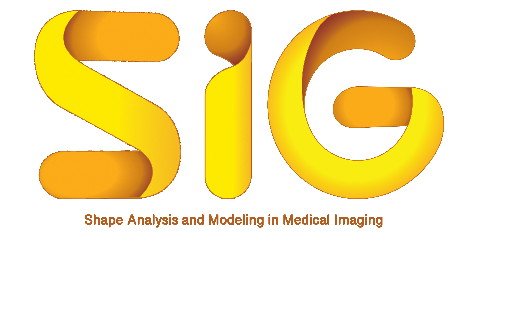

<a href="https://link.springer.com/book/10.1007/978-3-030-04747-4" target="_blank">>>Proceedings</a> 

<a href="program/" target="_blank">>>Program</a> 
<a href="keynotes/" target="_blank">>>Keynotes</a> 
<a href="location/" target="_blank">>>Location</a>

 We gladly announce the workshop on Shape in Medical Imaging (ShapeMI), which is held in conjunction with the conference on Medical Image Computing and Computer Assisted Interventions (<a href="http://www.miccai2020.org/en/" target="_blank">MICCAI 2020</a>) in Lima, Peru. The data is still TBD.  This workshop is the second instance of ShapeMI, after a successful <a href="https://sesami.github.io/shapemi2018/" target="_blank">ShapeMI'18</a>.

The goal of this workshop continues being a venue for the presentation of the leading methods and applications for advanced shape analysis and geometric learning in medical imaging. It will provide a venue for researchers working in shape/geometric modeling, learning, analysis, statistics, classification and applications to share novel ideas, to present recent research results and to interact with each other.

Today’s image data usually represents 3D geometric structures, often describing continuous and time-varying phenomena. Therefore, shape and geometry processing methods have been receiving increased attention, for example, due to their higher sensitivity to local variations relative to traditional markers, such as the volume of a structure. Shape and spectral analysis, learning and modeling algorithms, as well as application-driven research are at the focus of this workshop. In Medical Image Computing or Computer Aided Intervention, the understanding of shapes and their geometrical representations enables the modeling and analysis of organs, of anatomical or functional structures, as well as of high-dimensional structures in datasets representing population or disease data.
 

# Topics

 This workshop targets theoretical contributions as well as exciting applications in medical imaging, including (but not limited to): 

- Shape Processing and Analysis
- Shape Learning and Classification
- Geometric Learning and Manifold-based Methods
- Statistics of Shapes and Deformations
- Spectral Shape Analysis
- Spectral Clustering and Dimensionality Reduction
- Shape Modeling and Representation
- Shape Segmentation, Registration and Correspondence
- Longitudinal Shape Analysis and Processing
- Medical Applications focused on Shape Analysis
- Evaluation / quality assessment of shape models
- Relevant demos of freely available shape analysis software

# Academic objectives

 This workshops aims at bringing together medical imaging scientists to discuss novel approaches and application in shape and geometry processing and their use in research and clinical studies and applications. Another aim is to explore novel, cutting-edge theoretical methods and their usefulness for medical applications, such as from the fields of geometric learning or spectral shape analysis. As a single-track workshop, ShapeMI will feature excellent <a href="https://shapemi.github.io/keynotes/">keynote speakers</a>, <a href="https://shapemi.github.io/submission/">technical paper presentations and demonstrations</a> of state-of-the-art software for shape processing in medical research. 

# Organizers
- [Martin Reuter](http://reuter.mit.edu), German Center for Neurodegenerative Diseases, Bonn, Germany  
&nbsp;&nbsp;&nbsp;&nbsp;&nbsp;&nbsp;&nbsp;&nbsp;&nbsp;&nbsp;&nbsp;&nbsp;&nbsp;&nbsp;&nbsp;&nbsp;&nbsp;&nbsp;&nbsp;&nbsp;&nbsp;&nbsp;
& Harvard Medical School, Boston, USA
- [Christian Wachinger](http://wachinger.devweb.mwn.de/people/), Ludwig-Maximilian-University, Munich, Germany
- [Hervé Lombaert](https://profs.etsmtl.ca/hlombaert/), ETS Montreal, Canada & Inria Sophia-Antipolis, France
- [Beatriz Paniagua](https://www.kitware.com/beatriz-paniagua/), Kitware Inc. and University of North Carolina at Chapel Hill, USA
- [Orcun Goksel](http://people.ee.ethz.ch/~ogoksel/), ETH Zurich, Switzerland
- [Islem Rekik](http://basira-lab.com/), Istanbul TÜ, Turkey

# Advisory Board / Program Committee
- Aasa Feragen, DIKU
- Claudia Lindner, U Manchester
- Diana Mateus, EC Nantes
- Ellen Gasparovic, Union College, NY
- Ender Konukoglu, ETH Zürich
- Guido Gerig, NYU
- James Fishbaugh, NYU
- Julia Schnabel, King’s College London
- Julien Lefèvre, U Aix-Marseille
- Kathryn Leonard, OXI
- Kilian Pohl, SRI International
- Marc Niethammer, UNC
- Martin Styner, UNC
- Marius Linguraru, Children’s National Medical Center
- Miaomiao Zhang, UVA
- Philippe Buechler, U Bern
- Shireen Elhabian, SCI Utah
- Stefan Sommer, U Copenhagen
- Steve Pizer, UNC
- Tim Cootes, U Manchester
- Tinashe Mutsvangwa, U Cape Town
- Thomas Vetter, U Basel
- Umberto Castellani, U Verona
- Washington Mio, FSU
- Xavier Pennec, INRIA Sophia Antipolis
- Yonggang Shi, USC
- Yoshinobu Sato, NAIST

# Best Paper Award

TBD
The best paper award is sponsored by the 
