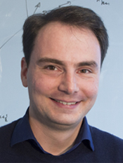

# Keynotes

## Daniel Rueckert 9:40 - 10:25

 Professor Daniel Rueckert is Head of the Department of Computing at Imperial College London. He joined the Department of Computing as a lecturer in 1999 and became senior lecturer in 2003. Since 2005 he is Professor of Visual Information Processing and leads the <a href="http://biomedic.doc.ic.ac.uk/" target="_blank">Biomedical Image Analysis group</a>. He received a Diploma in Computer Science (equiv to M.Sc.) from the Technical University Berlin and a Ph.D. in Computer Science from Imperial College London. Before moving to Imperial College, he has worked as a post-doctoral research fellow in the Division of Radiological Sciences and Medical Engineering, King’s College London where he has worked on the development of non-rigid registration algorithms for the compensation of tissue motion and deformation. The developed registration techniques have been successfully used for the non-rigid registration of various anatomical structures, including in the breast, liver, heart and brain and are currently commercialized by IXICO, an Imperial College spin-out company. During his doctoral and post-doctoral research he has published more than 300 journal and conference articles. Professor Rueckert is an associate editor of IEEE Transactions on Medical Imaging, a member of the editorial board of Medical Image Analysis, Image & Vision Computing and a referee for a number of international medical imaging journals and conferences. He has served as a member of organising and programme committees at numerous conferences, e.g. he has been General Co-chair of MMBIA 2006 and FIMH 2013 as well as Programme Co-Chair of MICCAI 2009, ISBI 2012 and WBIR 2012. In 2014, he has been elected as a Fellow of the MICCAI society and in 2015 he was elected as a Fellow of the Royal Academy of Engineering and as fellow of the IEEE.

## Michael Bronstein 12:10 - 12:55

Michael Bronstein (PhD with distinction 2007, Technion, Israel) is a professor at USI Lugano, Switzerland and Imperial College London, UK where he holds the Chair in Machine Learning and Pattern Recognition and Royal Society Wolfson Merit Award. During 2017-2018 he was a fellow at the Radcliffe Institute for Advanced Study at Harvard University. Michael's main research interest is in theoretical and computational methods for geometric data analysis. He authored over 150 papers, the book Numerical geometry of non-rigid shapes (Springer 2008), and over 20 granted patents. He was awarded four ERC grants, two Google Faculty Research awards, Amazon AWS Machine Learning award, and Rudolf Diesel fellowship (2017) at TU Munich. He was invited as a Young Scientist to the World Economic Forum, an honor bestowed on forty world’s leading scientists under the age of forty. Michael is a Senior Member of the IEEE, alumnus of the Technion Excellence Program and the Academy of Achievement, ACM Distinguished Speaker, and a member of the Young Academy of Europe. In addition to academic work, Michael is actively involved in commercial technology development and consulting to start-up companies. He was a co-founder and technology executive at Novafora (2005-2009) developing large-scale video analysis methods, and one of the chief technologists at Invision (2009-2012) developing low-cost 3D sensors. Following the multi-million acquisition of Invision by Intel in 2012, Michael has been one of the key developers of the Intel RealSense technology in the role of Principal Engineer. 

## Stanley Durrleman 15:40-16:25

 Stanley Durrleman is the co-director the joint Inria/ICM <a href="http://www.aramislab.fr/" target="_blank">Aramis Lab</a> at the <a href="http://icm-institute.org/en/" target="_blank">Brain and Spine Institute (ICM)</a> located within the Pitié-Salpêtrière hospital in Paris. He is also the coordinator of the ICM Center of Neuroinformatics, and scientific director of the ICM platform of biostatistics and bioinformatics. Stanley's research focuses on the development of new statistical and computational approaches for the analysis of image data and image-derived geometric data such a surface meshes. His team has contributed to the definition of statistical analysis methods and software (see their package <a href="http://www.deformetrica.org/" target="_blank">Deformetrica</a>) for spatiotemporal measurements in longitudinal studies, where sets of geometric objects (or structured data) are observed at multiple points in time. He received the Young Investigator Award from the conference MICCAI in 2008 and the second Gilles Kahn Award for best dissertation in computer science in 2010. In 2015, he was awarded an ERC Starting Grant from the European Research Council. Stanley is also the associate editor of IEEE Transactions on Medical Imaging.

