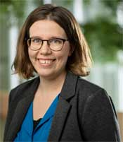
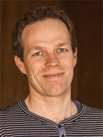

# Keynotes

## Ross Whitaker

Ross Whitaker earned a B.S. degree in Electrical Engineering and Computer Science from Princeton University in 1986, and a Ph.D. in Computer Science from the University of North Carolina in 1994.  Since 2000 he has been at the University of Utah, where he is a Professor in the School of Computing and the Scientific Computing
and Imaging Institute.  He is a recipient of the NSF Career Award andan IEEE and AIMBE Fellow.  He teaches discrete math, scientific visualization, probability and statistics, and image processing. He has leads a research group in image analysis, geometry processing, and scientific computing, with a variety of projects supported by both federal agencies and industrial contracts.  His published works have received over 14,000 citations. 
Keynote title: TBD 
Abstract: TBD 

## Aasa Feragen

Aasa Feragen completed her MSc (2005) and PhD (2010) degrees in mathematics from the University of Helsinki, after which she held postdocs at the University of Copenhagen (2009-2013) and the Max Planck Institute in Tübingen (2012-2013). Following several years as an Associate Professor at the University of Copenhagen (2014-), she is now Full Professor (2019-) at the Technical University of Denmark. Aasa's research sits at the intersection of machine learning and medical imaging, with a particular focus on graphs, trees and other complex data viewed from a geometric point of view. Of interest to the ShapeMI community, Aasa is co-chair of <a href="http://ipmi2021.org" target="_blank">IPMI 2021</a>, which we still hope to be able to hold at the beautiful island of Bornholm. 

Keynote title: <i>Uncertainty quantification in non-Euclidean domains</i>
Abstract: While raw data is usually handed to us in the form of Euclidean vectors of measurements, incorporation of prior or learned knowledge often leads us to leave the Euclidean domain: This can happen via enforcing known constraints or invariances that the data should adhere to, or by learning spatially varying dependencies and structures in the data, for instance via metric learning. 

In the first part of this talk, we will explain how Riemannian manifolds naturally appear as a data domain when incorporating prior or learned knowledge, and we will discuss basic properties of Riemannian manifolds that allow us to define Gaussian distributions and Gaussian processes on them. In the second part of the talk, we will showcase how manifold-valued Gaussian processes can be used to quantify uncertainty in manifold-valued regression and submanifold learning. Finally, we will discuss how these models relate to current geometry-aware models and open problems in deep learning. 

## Stefan Sommer

Stefan Sommer received his M.Sc. in mathematics in 2008, and his PhD in computer science in 2012 from the University of Copenhagen (UCPH). He is currently Associate Professor at the Department of Computer Science, UCPH. His research interests include shape analysis; statistics and machine learning on data with complex, geometric structure (geometric statistics); and foundational aspects of reinforcement learning. Stefan is heading the machine learning and data science education at UCPH. He is coauthor of the book Riemannian Geometric Statistics in Medical Image Analysis. Together with Aasa Feragen, Julia Schnabel and Mads Nielsen, Stefan will chair the IPMI conference in June/July 2021. 

Keynote title: <i>Stochastic Shape analysis and Probabilistic Geometric Statistics</i> 
Abstract: Geometric approaches to shape matching used in statistical shape analysis apply geodesics to model transitions between shapes. In the talk, I will show how such smooth geodesic models can be extended to account for noise and thereby model stochastic shape evolution. The resulting stochastic differential equations give rise to probability distributions on shape spaces enabling a probabilistic approach to shape statistics. Densities and likelihoods can here be computed using
stochastic versions of shape matching algorithms, denoted shape bridges.
I will connect these developments to a similar probabilistic approach to geometric statistics, the statistical analysis of general manifold valued data. The probabilistic viewpoint here results in new statistical constructions exemplified by diffusion means and probabilistic approaches to PCA on manifolds. 

