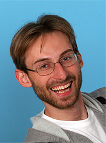

# Keynotes

## Daniel Rueckert

Professor Daniel Rueckert is Head of the Department of Computing at Imperial College London. He joined the Department of Computing as a lecturer in 1999 and became senior lecturer in 2003. Since 2005 he is Professor of Visual Information Processing and leads the [Biomedical Image Analysis group](http://biomedic.doc.ic.ac.uk/). He received a Diploma in Computer Science (equiv to M.Sc.) from the Technical University Berlin and a Ph.D. in Computer Science from Imperial College London. Before moving to Imperial College, he has worked as a post-doctoral research fellow in the Division of Radiological Sciences and Medical Engineering, King’s College London where he has worked on the development of non-rigid registration algorithms for the compensation of tissue motion and deformation. The developed registration techniques have been successfully used for the non-rigid registration of various anatomical structures, including in the breast, liver, heart and brain and are currently commercialized by IXICO, an Imperial College spin-out company. During his doctoral and post-doctoral research he has published more than 300 journal and conference articles. Professor Rueckert is an associate editor of IEEE Transactions on Medical Imaging, a member of the editorial board of Medical Image Analysis, Image & Vision Computing and a referee for a number of international medical imaging journals and conferences. He has served as a member of organising and programme committees at numerous conferences, e.g. he has been General Co-chair of MMBIA 2006 and FIMH 2013 as well as Programme Co-Chair of MICCAI 2009, ISBI 2012 and WBIR 2012. In 2014, he has been elected as a Fellow of the MICCAI society and in 2015 he was elected as a Fellow of the Royal Academy of Engineering and as fellow of the IEEE.

## Michael Bronstein

Michael Bronstein received his PhD (with distinction) in Computer Science from the Technion in 2007. Since 2010, he is associate professor of Informatics at the University of Lugano (USI), Switzerland, where he leads a research group on geometric and visual computing. Since 2012, he also serves as research scientist and principal engineer for Perceptual Computing at Intel. Since 2016, he is appointed as associate professor of Applied Mathematics at Tel Aviv University in Israel. He also held visiting appointments at Politecnico di Milano (2008), Stanford university (2008-2009), INRIA (2009), Technion (2013, 2014), University of Verona (2010, 2014), Harvard university (2017-2018), MIT (2017-2018), and Tel Aviv University (2015-). His main research interests are theoretical and computational methods in spectral and metric geometry and their application to problems in computer vision, pattern recognition, shape analysis, computer graphics, image processing, and machine learning. Most recently, he is interested in deep learning on non-Euclidean structured data such as graphs and manifolds. 
